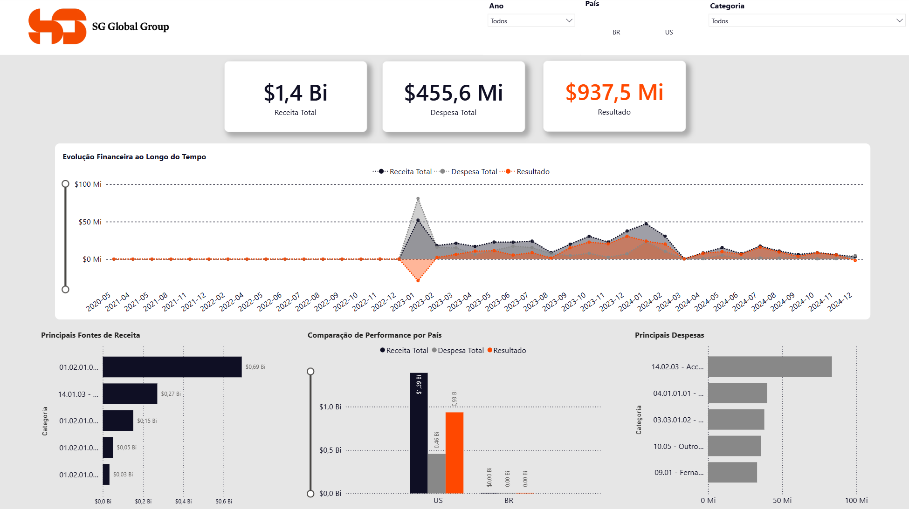

# Dashboard Financeiro para Leitura de DRE
### Financial Analytics Dashboard

Case Study — Análise Financeira com Power BI, Power Query, DAX e Python

Power BI • Power Query • DAX • Python • Excel • ETL • DRE • Business Intelligence • Gestão de Dados

Projeto desenvolvido para transformar bases financeiras descentralizadas da **SG Global Group** em uma visão executiva da Demonstração do Resultado do Exercício (DRE), permitindo acompanhar receita, despesa, resultado, performance por país e principais grupos de contas.



---

# Objetivo do Projeto

Este projeto demonstra como bases financeiras com estruturas diferentes podem ser consolidadas, tratadas e modeladas para análise executiva.

O foco não foi apenas criar um dashboard, mas construir uma solução analítica capaz de apoiar:

- Leitura consolidada da DRE
- Análise de receita, despesa e resultado
- Comparação de performance entre Brasil e Estados Unidos
- Tratamento de inconsistências em bases financeiras
- Criação de base oficial para uso no Power BI
- Apoio à tomada de decisão com indicadores claros
- Comunicação executiva dos principais resultados financeiros

---

# Meu Papel no Projeto

Atuei como **Líder de Projeto** e fui responsável pela **execução integral do trabalho**.

O projeto estava previsto como atividade em grupo no contexto prático da DNC, porém foi concluído individualmente por Frederico Augusto de Paula Amorim devido à desistência do colega durante o desenvolvimento.

---

# Teste Rápido

## Dashboard

1. Baixe este repositório.
2. Abra o arquivo:

```text
dashboard/dashboard-dre-sg-global.pbix
```

3. Navegue pelos filtros de ano, país e categoria.
4. Caso o Power BI solicite atualização da fonte de dados, a base oficial está em:

```text
data/raw/dre-br-us-dnc-tratada.xlsb
```

## Base consolidada

A base tratada em formato CSV para consulta e auditoria está em:

```text
data/processed/dre-consolidado-tratado.csv
```

## Reprocessamento dos dados

Para gerar novamente a base consolidada em CSV e o resumo de indicadores:

```bash
pip install -r requirements.txt
python src/prepare_dataset.py
```

---

# Saiba Mais

O projeto segue um fluxo simples de dados:

```text
Bases financeiras BR e US

↓

Tratamento de inconsistências e padronização

↓

Pré-tratamento da base US com Python

↓

Criação da base oficial consolidada

↓

Modelagem no Power BI

↓

Criação de medidas DAX

↓

Dashboard executivo da DRE

↓

Insights para tomada de decisão financeira
```

---

# Principais Funcionalidades

- Dashboard interativo para leitura da DRE.
- KPIs de Receita Total, Despesa Total e Resultado.
- Filtros por ano, país e categoria.
- Evolução financeira ao longo do tempo.
- Comparação de performance entre BR e US.
- Identificação das principais fontes de receita.
- Identificação das principais despesas.
- Base consolidada com mais de 50 mil registros.
- Tratamento de inconsistências estruturais na base US com Python.
- Documentação organizada para fins de portfólio.

---

# Resultados Obtidos

A análise consolidou os seguintes indicadores principais:

| Indicador | Resultado |
|---|---:|
| Registros consolidados | 50.022 |
| Receita total analisada | US$ 1,4 Bi |
| Despesa total analisada | US$ 455,6 Mi |
| Resultado consolidado | US$ 937,5 Mi |
| País com maior participação | US |
| Principal fonte de receita | 01.02.01.02.10 - EB2 - NIW - Desdobramento |
| Principal despesa | 14.02.03 - Accounts Payable (A/P) |
| Base crítica tratada | US |

> Observação: o projeto identifica impacto financeiro, riscos e oportunidades de leitura gerencial da DRE. Não foi considerado ganho financeiro realizado após implantação, pois esse dado não estava disponível nos materiais analisados.

---

# Estrutura do Repositório

```text
dashboard-dre-sg-global-powerbi/
├── assets/
│   ├── dashboard-preview.png
│   ├── project-cover.png
│   ├── logo-sg-global.png
│   └── logo-sg-global-alt.png
├── dashboard/
│   └── dashboard-dre-sg-global.pbix
├── data/
│   ├── raw/
│   │   ├── dre-br-dnc-base.csv
│   │   ├── dre-us-dnc-base.csv
│   │   └── dre-br-us-dnc-tratada.xlsb
│   ├── processed/
│   │   ├── dre-consolidado-tratado.csv
│   │   └── resumo-indicadores.json
│   └── data_dictionary.md
├── docs/
│   ├── 00-sobre-o-projeto.md
│   ├── 01-guia-de-execucao.md
│   ├── 02-metodologia-etl.md
│   ├── 03-modelagem-e-indicadores.md
│   ├── 04-resultados-e-insights.md
│   ├── 05-relatorio-de-desenvolvimento.md
│   └── 99-modelo-readme-portfolio.md
├── src/
│   └── prepare_dataset.py
├── README.md
├── requirements.txt
└── .gitignore
```

---

# Explore o Projeto

Novo por aqui?

➡️ [00 - Sobre o Projeto](docs/00-sobre-o-projeto.md)

Quer testar o dashboard?

➡️ [01 - Guia de Execução](docs/01-guia-de-execucao.md)

Quer entender a metodologia?

➡️ [02 - Metodologia e ETL](docs/02-metodologia-etl.md)

Quer conhecer a modelagem?

➡️ [03 - Modelagem e Indicadores](docs/03-modelagem-e-indicadores.md)

Quer ver os insights?

➡️ [04 - Resultados e Insights](docs/04-resultados-e-insights.md)

Quer acompanhar a construção do case?

➡️ [05 - Relatório de Desenvolvimento](docs/05-relatorio-de-desenvolvimento.md)

Quer reutilizar o mesmo padrão em outros projetos?

➡️ [99 - Modelo de README para Portfólio](docs/99-modelo-readme-portfolio.md)

---

# Tecnologias Utilizadas

- Microsoft Power BI
- Power Query
- DAX
- Microsoft Excel
- Python
- PyXLSB
- CSV
- Git
- GitHub

---

# Sobre os Dados

A base utilizada foi fornecida no contexto de um projeto prático educacional da DNC.

O repositório foi organizado para fins de demonstração técnica e portfólio. Documentos brutos com contatos, transcrições e materiais de apresentação foram utilizados apenas como referência de análise e não foram incluídos na versão final publicável.

---

# Competências Demonstradas

- Análise de Dados
- Gestão de Dados
- Business Intelligence
- Power BI
- Power Query
- DAX
- Python aplicado a tratamento de dados
- ETL e padronização de bases
- Modelagem analítica
- Construção de dashboards financeiros
- Comunicação de resultados
- Organização de projetos para GitHub

---

### Desenvolvido como projeto de portfólio

Gestão de Dados • Análise de Dados • Engenharia de Dados • Business Intelligence
